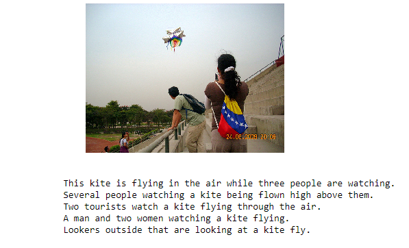
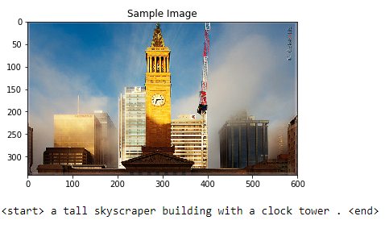
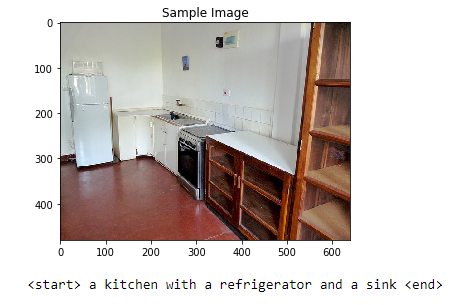
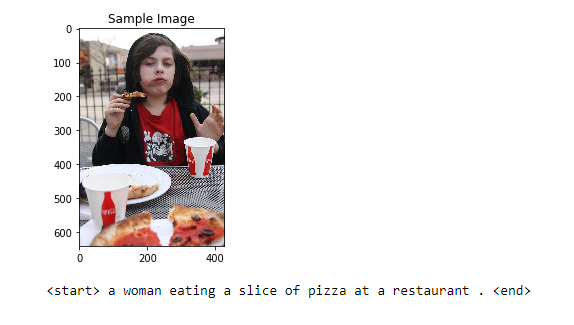
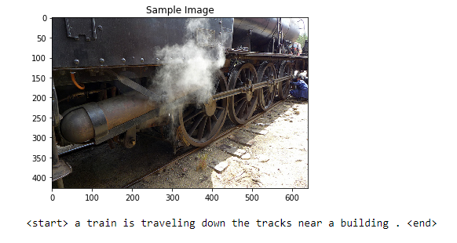
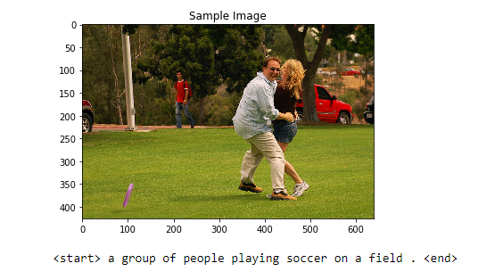

# Image-caption
This repository contains Automatic Image Captioning Project

### Combine CNN and RNN knowledge to build a network that automatically produces captions, given an input image.
### I have trained this model on GPU for 10 hours and reached 2.1788% loss with 3 epochs in the automated image captioning using a ResNet50 pre trained model.

#### The Dataset i have used is the Microsoft Common Objects in COntext (MS COCO) dataset is a large-scale dataset for scene understanding. The dataset is commonly used to train and benchmark object detection, segmentation, and captioning algorithms.

### The Dataset looks like :-

The output have image with it's 5  different captions

We then train our model and output we got is:-

We then find when our model performed well by analyzing the outputs:-

We then find when our model does not performed well i.e when they give different captions which is not relevant to the given input image

